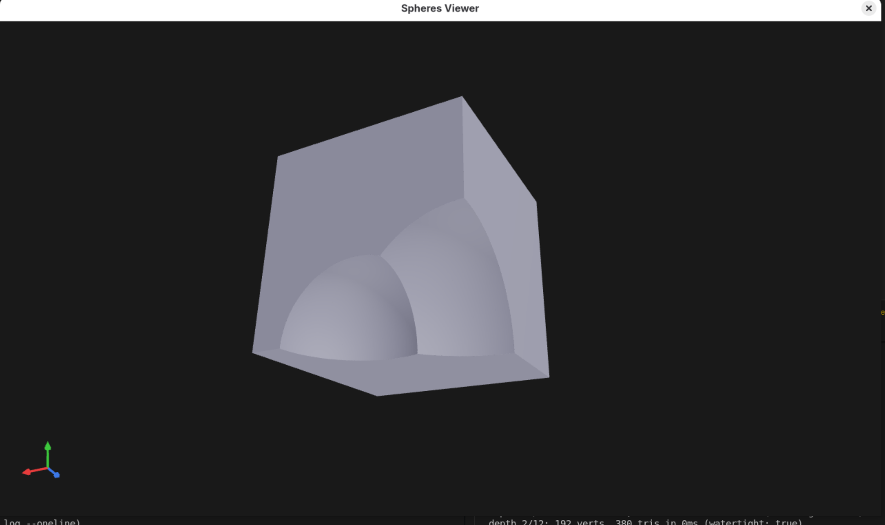
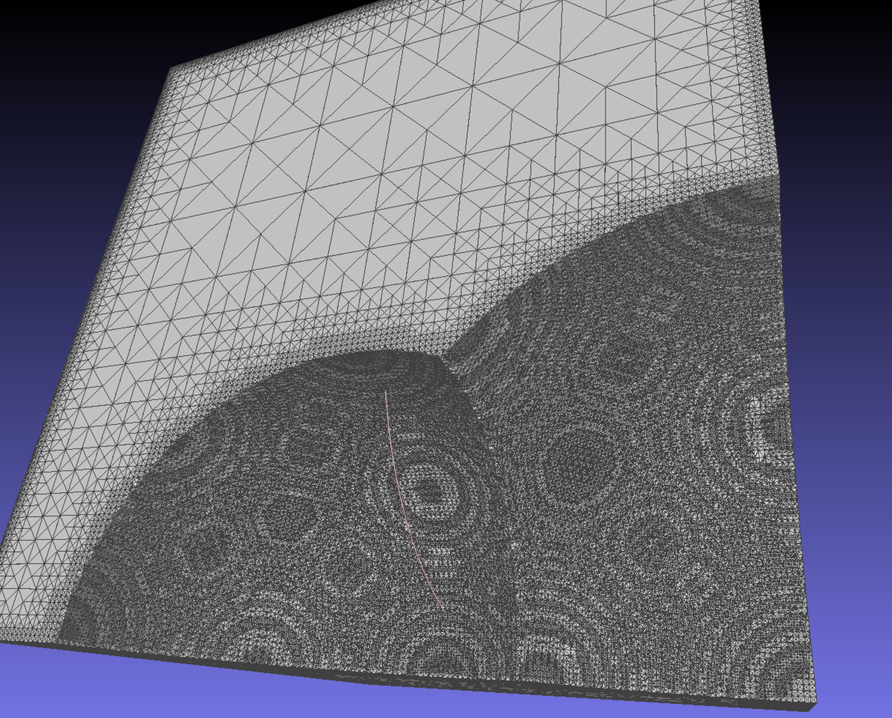

# sdf-cad

SDF-based 3D mesh generation using adaptive BCC (body-centered cubic) marching pyramids.



## Overview

sdf-cad takes signed distance function (SDF) descriptions of 3D solids and produces triangle meshes. It reads an OpenSCAD-like scene description language and renders them in an interactive 3D viewer.

**Pipeline:** `Solid` (SDF, negative=inside) → balanced adaptive octree → BCC marching pyramids → triangle mesh



## Features

- **SDF primitives:** sphere, cube, cylinder, cone, capsule, torus, rounded box, plane
- **CSG operations:** union, difference, intersection (with smooth variants)
- **Transforms:** translate, rotate, scale, mirror, repeat
- **Adaptive meshing:** octree-based refinement concentrates detail where the SDF has high curvature
- **OpenSCAD parser:** built-in parser for a subset of the OpenSCAD language
- **Interactive viewer:** real-time 3D preview with progressive mesh refinement
- **File watching:** edit `scene.scad` and see results update live

## Usage

Create a `scene.scad` file:

```scad
difference() {
    cube(2, center=true);
    sphere(1.3);
}
```

Run the viewer:

```sh
cargo run --release
```

The viewer watches `scene.scad` for changes and progressively refines the mesh from coarse to fine.

## Building

Requires a Rust toolchain. If using Nix:

```sh
nix develop
cargo build --release
```

Otherwise, ensure you have the following system dependencies:
- OpenGL libraries (libGL)
- X11 libraries (libX11, libXcursor, libXrandr, libXi) on Linux
- pkg-config and openssl

Then:

```sh
cargo build --release
```

## License

MIT
